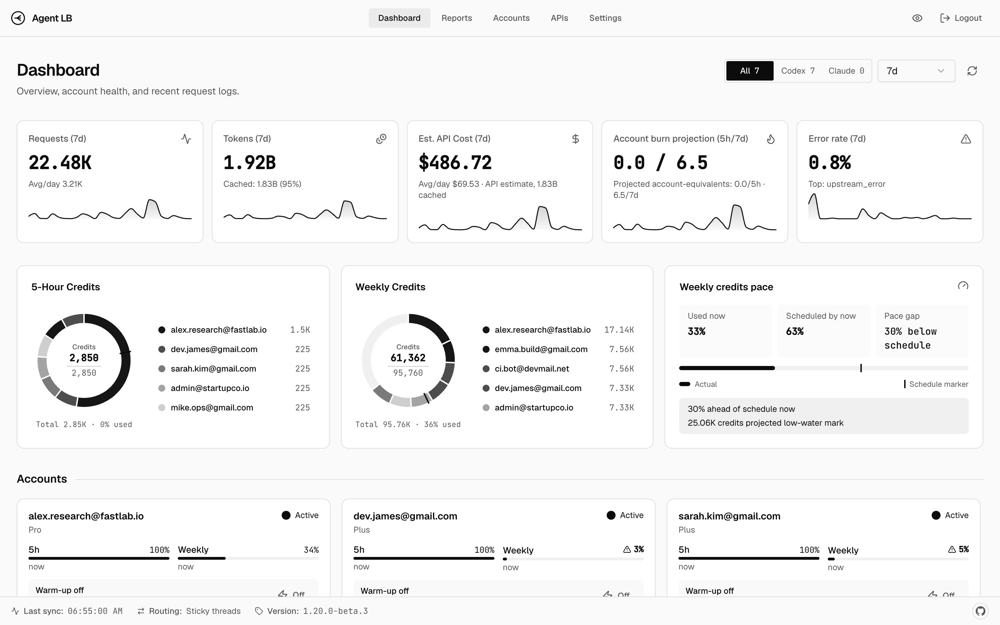
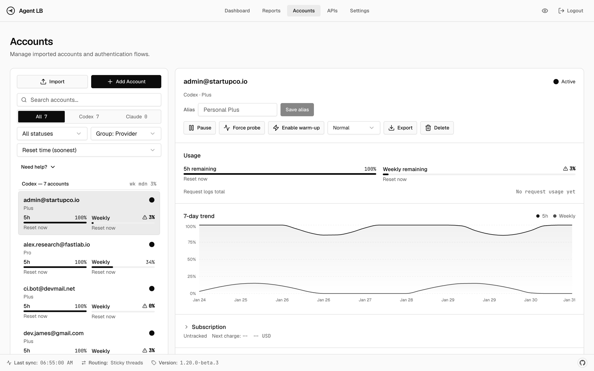
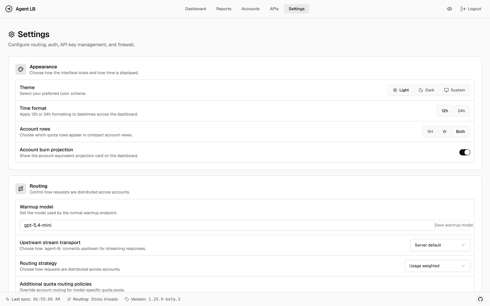
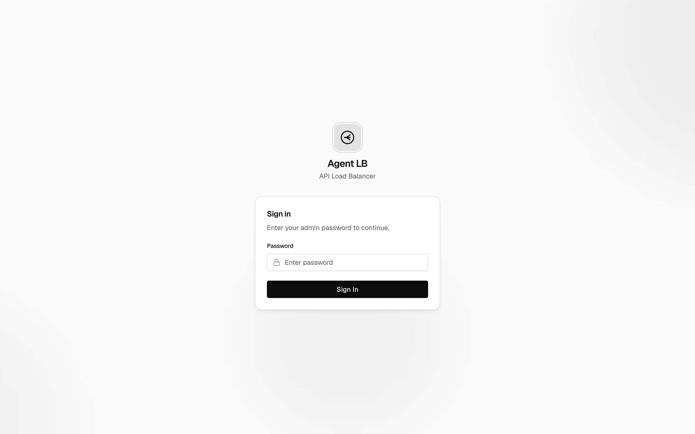
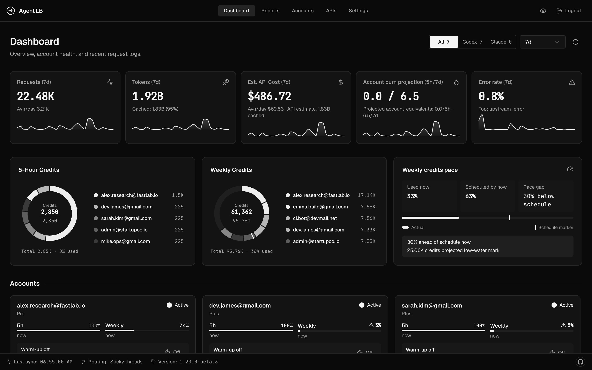
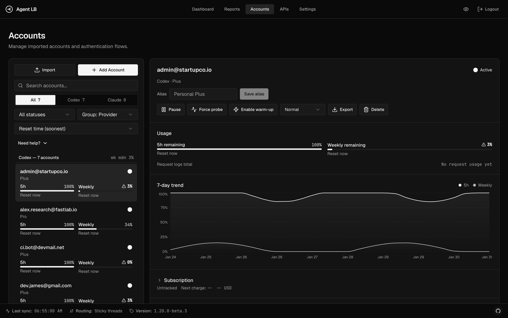
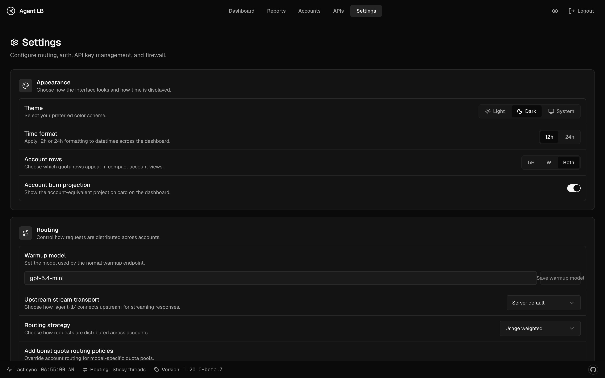

<!--
About
ChatGPT and Claude account load balancer & proxy with usage tracking, dashboard, and OpenAI/Anthropic-compatible endpoints

Topics
python oauth sqlalchemy dashboard load-balancer openai anthropic claude rate-limit api-proxy codex fastapi usage-tracking chatgpt opencode openclaw

Resources
Homepage https://github.com/aneym/agent-lb
Repository https://github.com/aneym/agent-lb
Issues https://github.com/aneym/agent-lb/issues
Releases https://github.com/aneym/agent-lb/releases
Discussions https://github.com/aneym/agent-lb/discussions
Security https://github.com/aneym/agent-lb/security/advisories/new
-->

# agent-lb

Load balancer for ChatGPT and Claude accounts. Pool multiple accounts, track usage, manage API keys, view everything in a dashboard.

## 🤖 Agents look here

**Humans:** don't read further — paste this into your coding agent (Claude Code, Codex
CLI, Cursor, …) and let it drive. **Agents:** your entrypoints are
[GETTING-STARTED.md](GETTING-STARTED.md) (setup runbook) and [AGENTS.md](AGENTS.md)
(working on the codebase); setup and operations never require the dashboard.

```text
Clone https://github.com/aneym/agent-lb into ~/repos/agent-lb, cd into it, and read
GETTING-STARTED.md. Follow it top to bottom to set me up:

1. Install dependencies and start the local agent-lb service.
2. Walk me through connecting my Claude/ChatGPT accounts ONE AT A TIME — for each
   account give me the browser URL, wait for me to approve (and paste back the code
   where required), confirm it connected, then move to the next.
3. When wiring Claude Code, never set ANTHROPIC_AUTH_TOKEN or ANTHROPIC_API_KEY;
   use the agent-lb base URL or launcher only so subscription billing stays intact.
4. Wire up my CLI clients (show exact dotfile edits and ask before applying them).
5. Finish by probing every account with a real request and telling me each account's
   state per the "Account health model" (usable / unsubscribed / disconnected),
   plus a short status summary of service, accounts, and wired clients.

If anything is already installed or running, detect it and skip ahead.
```

The full walkthrough lives in [GETTING-STARTED.md](GETTING-STARTED.md). If your agent is
Claude Code or Codex launched inside the repo, saying **"get started"** triggers the
`get-started` skill, which follows the same runbook.

For post-setup account-specific work — quota reset checks, stuck or rate-limited
account triage, billing/subscription changes, pause/reactivate routing,
verification, or browser-profile work — say **"account operator"**. Repo-aware
agents should use the `agent-lb-account-operator` skill and local
`.agent-lb/account-profiles.json` registry for that work.

|  |  |
| :------------------------------------------: | :----------------------------------------: |

<details>
<summary>More screenshots</summary>

|                  Settings                  |                Login                 |
| :----------------------------------------: | :----------------------------------: |
|  |  |

|                    Dashboard (dark)                    |                   Accounts (dark)                    |                   Settings (dark)                    |
| :----------------------------------------------------: | :--------------------------------------------------: | :--------------------------------------------------: |
|  |  |  |

</details>

## Features

<table>
<tr>
<td><b>Account Pooling</b><br>Load balance across multiple ChatGPT and Claude accounts</td>
<td><b>Usage Tracking</b><br>Per-account tokens, cost, 28-day trends</td>
<td><b>API Keys</b><br>Per-key rate limits by token, cost, window, model</td>
</tr>
<tr>
<td><b>Dashboard Auth</b><br>Password + optional TOTP</td>
<td><b>Client-compatible</b><br>Codex CLI, Claude Code, OpenCode, OpenClaw, and SDKs</td>
<td><b>Auto Model Sync</b><br>Available models fetched from upstream</td>
</tr>
</table>

## Quick Start

### Source checkout

This always works, including before PyPI/GHCR artifacts for a prerelease have
been published:

```bash
git clone https://github.com/aneym/agent-lb.git
cd agent-lb
uv sync
scripts/install-service.sh
```

Source checkout starts the API/service. A git clone does not include built
dashboard assets; connect accounts from the CLI with
[`GETTING-STARTED.md` step 4](GETTING-STARTED.md#4-connect-accounts--one-at-a-time):

```bash
scripts/anthropic-auth.sh start
scripts/openai-auth.sh start
```

To use the dashboard from a source checkout, build the frontend and restart the
service:

```bash
cd frontend && bun install && bun run build
cd ..
scripts/install-service.sh
```

### Published beta artifacts

After the `v1.20.0-beta.3` release workflow has published artifacts:

```bash
# Docker
docker volume create agent-lb-data
docker run -d --name agent-lb \
  -p 2455:2455 -p 1455:1455 \
  -v agent-lb-data:/var/lib/agent-lb \
  ghcr.io/aneym/agent-lb:1.20.0-beta.3

# or uvx
uvx --from "agent-lb==1.20.0b3" agent-lb
```

Open [localhost:2455](http://localhost:2455) → Add account → Done.

## Remote Setup

When accessing the dashboard remotely for the first time, a bootstrap token is required to set the initial password.

**Auto-generated (default):** On first startup (no password configured), the server generates a one-time token and prints it to logs:

```bash
docker logs agent-lb
# ============================================
#   Dashboard bootstrap token (first-run):
#   <token>
# ============================================
```

Open the dashboard → enter the token + new password → done. The token is shared across replicas and remains valid until a password is set. In multi-replica setups, replicas must share the same encryption key (the Helm chart default) for restart recovery to work.

**Manual token:** To use a fixed token instead, set the env var before starting:

```bash
docker run -d --name agent-lb \
  -e AGENT_LB_DASHBOARD_BOOTSTRAP_TOKEN=your-secret-token \
  -p 2455:2455 -p 1455:1455 \
  -v agent-lb-data:/var/lib/agent-lb \
  ghcr.io/aneym/agent-lb:1.20.0-beta.3
```

**Local access** (localhost) bypasses bootstrap entirely — no token needed.

## Client Setup

Point each client at the matching agent-lb surface. OpenAI-compatible clients use `/v1`, Codex uses `/backend-api/codex`, and Claude Code uses the Anthropic-compatible base URL. Anthropic-compatible SDKs use the same root Messages API surface. If [API key auth](#api-key-authentication) is enabled, pass a key from the dashboard as a Bearer token for HTTP clients that support it.

Use `127.0.0.1` only for clients running on the same machine as agent-lb.
Server-side app integrations such as the Vercel AI SDK or OpenAI SDK can set
their OpenAI-compatible base URL to `/v1`; browser-direct code and deployed
loopback URLs cannot reach or spend a user's local subscription accounts.

Model availability is discovered from the upstream Codex model catalog and can vary by account plan, workspace, rollout, and upstream deprecation state. Prefer the live `GET /v1/models` or `GET /backend-api/codex/models` response over a copied static table when configuring clients or API-key model allowlists.

| Logo                                                                                                              | Client                   | Endpoint                                  | Config                             |
| ----------------------------------------------------------------------------------------------------------------- | ------------------------ | ----------------------------------------- | ---------------------------------- |
|                         | **Codex CLI**            | `http://127.0.0.1:2455/backend-api/codex` | `~/.codex/config.toml`             |
|                      | **Claude Code**          | `http://127.0.0.1:2455`                   | `ANTHROPIC_BASE_URL` / launcher    |
|                      | **Anthropic Python SDK** | `http://127.0.0.1:2455`                   | Code                               |
|                      | **OpenCode**             | `http://127.0.0.1:2455/v1`                | `~/.config/opencode/opencode.json` |
|                      | **OpenClaw**             | `http://127.0.0.1:2455/v1`                | `~/.openclaw/openclaw.json`        |
|        | **Vercel AI SDK**        | `http://127.0.0.1:2455/v1`                | Server route / action              |
|  | **OpenAI Python SDK**    | `http://127.0.0.1:2455/v1`                | Code                               |

<details>
<summary>&ensp;<b>Codex CLI / IDE Extension</b></summary>
<br>

`~/.codex/config.toml`:

```toml
model = "gpt-5.3-codex"
model_reasoning_effort = "xhigh"
model_provider = "agent-lb"

[model_providers.agent-lb]
name = "openai"  # required — enables remote /responses/compact. Lowercase since Codex 2026-05-23; older "OpenAI" stops resolving gpt-5.5
base_url = "http://127.0.0.1:2455/backend-api/codex"
wire_api = "responses"
supports_websockets = true
requires_openai_auth = true # required for codex app
```

Optional: enable native upstream WebSockets for Codex streaming while keeping `agent-lb` pooling:

```bash
export AGENT_LB_UPSTREAM_STREAM_TRANSPORT=websocket
```

`auto` is the default and uses native WebSockets for native Codex headers or models that prefer them.
You can also switch this in the dashboard under Settings -> Routing -> Upstream stream transport.

Note: Codex itself does not currently expose a stable documented `wire_api = "websocket"` provider mode.
If you want to experiment on the Codex side, the current CLI exposes under-development feature flags:

```toml
[features]
responses_websockets = true
# or
responses_websockets_v2 = true
```

These flags are experimental and do not replace `wire_api = "responses"`.

Upstream websocket handshakes automatically honor standard proxy environment variables when they are
present. `wss://` handshakes check `wss_proxy`, `socks_proxy`, `https_proxy`, and `all_proxy`;
plain `ws://` handshakes also check `ws_proxy` and `http_proxy`. Set
`AGENT_LB_UPSTREAM_WEBSOCKET_TRUST_ENV=false` only when websocket handshakes must bypass those
environment proxies and connect directly.

**With [API key auth](#api-key-authentication):**

```toml
[model_providers.agent-lb]
name = "openai"
base_url = "http://127.0.0.1:2455/backend-api/codex"
wire_api = "responses"
env_key = "AGENT_LB_API_KEY"
supports_websockets = true
requires_openai_auth = true # required for codex app
```

```bash
export AGENT_LB_API_KEY="sk-clb-..."   # key from dashboard
codex
```

**Verify WebSocket transport**

Use a one-off debug run:

```bash
RUST_LOG=debug codex exec "Reply with OK only."
```

Healthy websocket signals:

- CLI logs contain `connecting to websocket` and `successfully connected to websocket`
- `agent-lb` logs show `WebSocket /backend-api/codex/responses`
- `agent-lb` logs do **not** show fallback `POST /backend-api/codex/responses` for the same run

If you run `agent-lb` behind a reverse proxy, make sure it forwards WebSocket upgrades.

**Migrating from direct OpenAI** — `codex resume` filters by `model_provider`;
old sessions won't appear until you re-tag them. Use the built-in retag command
instead of editing Codex files by hand; see
[Codex session retagging](openspec/specs/runtime-portability/context.md#codex-session-retagging) for backups, Docker, WSL,
and rollback details.

```bash
# Preview what will change first.
agent-lb codex-sessions retag --from openai --to agent-lb --dry-run

# Then close Codex/Codex CLI and apply the retag.
agent-lb codex-sessions retag --from openai --to agent-lb --yes
```

</details>

<details>
<summary>&ensp;<b>Claude Code</b></summary>
<br>

Connect Claude (Anthropic) accounts first — `scripts/anthropic-auth.sh` or step 4 of
[GETTING-STARTED.md](GETTING-STARTED.md). Then either launch with the base URL only:

```bash
ANTHROPIC_BASE_URL=http://127.0.0.1:2455 claude
```

or install the vendored `cc` launcher and canonical routing policy. Preview the exact
changes first; installation preserves existing regular client/hook files, checkpoints
changed global configuration, and removes retired CCDEX artifacts when present:

```bash
scripts/install-claude-clients.sh --print
scripts/install-claude-clients.sh
```

`cc` defaults to Fable/high. GPT compatibility seats run inside the Claude Code harness
through agent-lb's server-side model aliases. The installer semantically updates only
routing-owned Markdown blocks and the Claude model field; unrelated global
configuration remains intact.

For Claude Desktop's embedded **Code** runtime on macOS, install the dedicated shared
loopback proxy after the main service is healthy:

```bash
scripts/install-claude-desktop-proxy.sh --print
scripts/install-claude-desktop-proxy.sh
```

It runs as the KeepAlive LaunchAgent
`com.aneyman.agent-lb-claude-desktop-proxy`, verifies the proxied Anthropic health
endpoint before atomically updating `~/.claude/settings.json`, and preserves unrelated
settings. Fully quit and reopen Claude Desktop after install. This routes the embedded
Code runtime; ordinary Claude Desktop chat is not a supported or claimed surface.
Within `api.anthropic.com`, only Messages API calls route to agent-lb. OAuth, telemetry,
feature, and Code worker traffic keeps its caller credentials and goes directly to
Anthropic; unknown future paths default direct.

Verify the integration by running a Desktop Code task and correlating it with a fresh
agent-lb request/session record. Logs are written to
`~/.agent-lb/claude-desktop-proxy.err.log`. To remove it and conditionally restore only
installer-owned settings:

```bash
scripts/install-claude-desktop-proxy.sh --uninstall
```

> **Important**: do **not** set `ANTHROPIC_AUTH_TOKEN` or `ANTHROPIC_API_KEY` when pointing
> Claude Code at agent-lb. Setting either flips Claude Code from subscription ("Claude Max")
> billing to per-token API billing. The launcher strips both defensively and falls back to
> plain `claude` if the load balancer is down (`CLAUDE_LB_DISABLE=1` forces the bypass).

Sticky routing without the launcher: claim a route via `POST /api/anthropic/session-route`
with `{"sessionId", "model", "quotaKey"}` and send `x-claude-session-id: <sessionId>` on
requests.

</details>

<details>
<summary>&ensp;<b>Anthropic Python SDK</b></summary>
<br>

Install the official Anthropic SDK:

```bash
pip install anthropic
```

Use this from server-side code or a trusted local script:

```python
import os

from anthropic import Anthropic

client = Anthropic(
    base_url=os.environ.get("AGENT_LB_ANTHROPIC_BASE_URL", "http://127.0.0.1:2455"),
    auth_token=os.environ.get("AGENT_LB_API_KEY", "sk-local"),
)

message = client.messages.create(
    model="claude-sonnet-4-20250514",
    max_tokens=64,
    messages=[{"role": "user", "content": "Hello!"}],
)
print(message.content[0].text)
```

`auth_token` makes the SDK send the Agent LB key as `Authorization: Bearer ...`,
which is required when [API key auth](#api-key-authentication) is enabled. Use a
dashboard key in `AGENT_LB_API_KEY`; if auth is disabled and the script runs on
the same machine, any non-empty local placeholder is fine.

Do not export `ANTHROPIC_AUTH_TOKEN` or `ANTHROPIC_API_KEY` as Agent LB
placeholders. Those names are first-party Anthropic/Claude credentials; keep LB
credentials in `AGENT_LB_API_KEY` and pass them explicitly in SDK code.

Like the OpenAI-compatible SDK examples, keep this server-side or local.
Browser-direct code and deployed loopback URLs cannot reach or spend local
subscription accounts through the LB.

</details>

<details>
<summary>&ensp;<b>OpenCode</b></summary>
<br>

> **Important**: Use the built-in `openai` provider with `baseURL` override — not a custom provider with `@ai-sdk/openai-compatible`. Custom providers use the Chat Completions API which **drops reasoning/thinking content**. The built-in `openai` provider uses the Responses API, which properly preserves `encrypted_content` and multi-turn reasoning state.

Before starting, make sure all existing OpenAI credentials are cleared from `~/.local/share/opencode/auth.json`.
You can clean the config by using this one-liner
`jq 'del(.openai)' ~/.local/share/opencode/auth.json > auth.json.tmp && mv auth.json.tmp ~/.local/share/opencode/auth.json`

`~/.config/opencode/opencode.json`:

```jsonc
{
  "$schema": "https://opencode.ai/config.json",
  "provider": {
    "openai": {
      "options": {
        "baseURL": "http://127.0.0.1:2455/v1",
        "apiKey": "{env:AGENT_LB_API_KEY}",
      },
      "models": {
        "gpt-5.4": {
          "name": "GPT-5.4",
          "reasoning": true,
          "options": {
            "reasoningEffort": "high",
            "reasoningSummary": "detailed",
          },
          "limit": { "context": 1050000, "output": 128000 },
        },
        "gpt-5.3-codex": {
          "name": "GPT-5.3 Codex",
          "reasoning": true,
          "options": {
            "reasoningEffort": "high",
            "reasoningSummary": "detailed",
          },
          "limit": { "context": 272000, "output": 65536 },
        },
        "gpt-5.1-codex-mini": {
          "name": "GPT-5.1 Codex Mini",
          "reasoning": true,
          "options": {
            "reasoningEffort": "high",
            "reasoningSummary": "detailed",
          },
          "limit": { "context": 272000, "output": 65536 },
        },
        "gpt-5.3-codex-spark": {
          "name": "GPT-5.3 Codex Spark",
          "reasoning": true,
          "options": {
            "reasoningEffort": "xhigh",
            "reasoningSummary": "detailed",
          },
          "limit": { "context": 128000, "output": 65536 },
        },
      },
    },
  },
  "model": "openai/gpt-5.3-codex",
}
```

This overrides the built-in `openai` provider's endpoint to point at agent-lb while keeping the Responses API code path that handles reasoning properly.

```bash
export AGENT_LB_API_KEY="sk-clb-..."   # key from dashboard
opencode
```

</details>

<details>
<summary>&ensp;<b>OpenClaw</b></summary>
<br>

`~/.openclaw/openclaw.json`:

```jsonc
{
  "agents": {
    "defaults": {
      "model": { "primary": "agent-lb/gpt-5.4" },
      "models": {
        "agent-lb/gpt-5.4": { "params": { "cacheRetention": "short" } },
        "agent-lb/gpt-5.4-mini": { "params": { "cacheRetention": "short" } },
        "agent-lb/gpt-5.3-codex": { "params": { "cacheRetention": "short" } },
      },
    },
  },
  "models": {
    "mode": "merge",
    "providers": {
      "agent-lb": {
        "baseUrl": "http://127.0.0.1:2455/v1",
        "apiKey": "${AGENT_LB_API_KEY}", // or "dummy" if API key auth is disabled
        "api": "openai-responses",
        "models": [
          {
            "id": "gpt-5.4",
            "name": "gpt-5.4 (agent-lb)",
            "contextWindow": 1050000,
            "contextTokens": 272000,
            "maxTokens": 4096,
            "input": ["text"],
            "reasoning": false,
          },
          {
            "id": "gpt-5.4-mini",
            "name": "gpt-5.4-mini (agent-lb)",
            "contextWindow": 400000,
            "contextTokens": 272000,
            "maxTokens": 4096,
            "input": ["text"],
            "reasoning": false,
          },
          {
            "id": "gpt-5.3-codex",
            "name": "gpt-5.3-codex (agent-lb)",
            "contextWindow": 400000,
            "contextTokens": 272000,
            "maxTokens": 4096,
            "input": ["text"],
            "reasoning": false,
          },
        ],
      },
    },
  },
}
```

Set the env var or replace `${AGENT_LB_API_KEY}` with a key from the dashboard. If API key auth is disabled,
local requests can omit the key, but non-local requests are still rejected until proxy authentication is configured.

The `/v1` route is the simplest OpenAI-compatible setup. If your OpenClaw build uses a Codex-native provider path such as `openai-codex-responses` and needs Codex-style usage/accounting behavior, point that provider at `http://127.0.0.1:2455/backend-api/codex` instead. For third-party Codex-compatible backends, the client must allow opaque bearer-token passthrough and should only send `chatgpt-account-id` when it actually decoded one from an official ChatGPT/Codex token.

</details>

<details>
<summary>&ensp;<b>Vercel AI SDK</b></summary>
<br>

Install the OpenAI provider in the app:

```bash
pnpm add ai @ai-sdk/openai
```

Use this only from server-side code, such as a route handler or server action:

```ts
import { createOpenAI } from "@ai-sdk/openai";
import { generateText } from "ai";

const agentLB = createOpenAI({
  baseURL: process.env.AGENT_LB_BASE_URL ?? "http://127.0.0.1:2455/v1",
  apiKey: process.env.AGENT_LB_API_KEY ?? "sk-local",
});

export async function POST(req: Request) {
  const { prompt } = await req.json();
  const { text } = await generateText({
    model: agentLB.responses("gpt-5.3-codex"),
    prompt,
  });

  return Response.json({ text });
}
```

`127.0.0.1:2455` works only when that server route runs on the same machine as
agent-lb. Deployed apps need `AGENT_LB_BASE_URL` set to a reachable Agent LB URL
and should not route through Vercel AI Gateway if the goal is to spend local
subscription accounts through this proxy.

</details>

<details>
<summary>&ensp;<b>OpenAI Python SDK</b></summary>
<br>

```python
from openai import OpenAI

client = OpenAI(
    base_url="http://127.0.0.1:2455/v1",
    api_key="sk-clb-...",  # from dashboard, or any non-empty string if auth is disabled
)

response = client.chat.completions.create(
    model="gpt-5.3-codex",
    messages=[{"role": "user", "content": "Hello!"}],
)
print(response.choices[0].message.content)
```

</details>

## macOS Menu Bar App

A native macOS 26 menu bar companion (`clients/macos-menubar/`) puts the
dashboard's vitals one click away: a status-bar ring gauge that drains with
the pool's 5-hour window, separated 5-hour / weekly limit cards with
`next reset in … · +n cr` recovery, a provider scope control (All / Codex /
Claude) that filters every stat exactly like the dashboard, an account list
with status/sort/search filtering and pause/reactivate, recent requests, and
service start/restart/stop via launchd.

```bash
cd clients/macos-menubar
make install   # build, bundle, and register as a login LaunchAgent (starts now + at every login)
```

`make install` is the supported way to run it: it registers the app in the
GUI launchd domain, which makes startup automatic at login. (Launching the
bundle with `open` from an SSH session silently fails to register the menu
bar item on macOS 26 — use the LaunchAgent.) `make uninstall` removes it;
`make test` runs the unit suite.

**Remote machines (Tailscale):** copy `AgentLB.app` anywhere (e.g.
`~/Applications`), point it at the service host, and register the agent for
the copied path:

```bash
defaults write com.aneyman.agentlb.menubar baseURL "https://<host>.<tailnet>.ts.net:2455"
make install-agent APP_PATH=$HOME/Applications/AgentLB.app
```

When the base URL isn't local the app runs in remote mode: the header shows
the host and the launchd service controls hide. If your menu bar is full
(notched MacBooks hide overflow items), nudge the icon right of the notch:

```bash
defaults write com.aneyman.agentlb.menubar "NSStatusItem Preferred Position Item-0" -float 220
```

## API Key Authentication

API key auth is **disabled by default**. In that mode, only local requests to the protected proxy routes can
proceed without a key; non-local requests are rejected until proxy authentication is configured. Enable it in
**Settings → API Key Auth** on the dashboard when clients connect remotely or through Docker, VM, or container
networking that appears non-local to the service.

When enabled, clients must pass a valid API key as a Bearer token:

```
Authorization: Bearer sk-clb-...
```

The protected proxy routes covered by this setting are:

- `/v1/*` (except `/v1/usage`, which always requires a valid key)
- `/backend-api/codex/*`
- `/backend-api/transcribe`

**Creating keys**: Dashboard → API Keys → Create. The full key is shown **only once** at creation. Keys support optional expiration, model restrictions, and rate limits (tokens / cost per day / week / month).

## Configuration

Environment variables with `AGENT_LB_` prefix or `.env.local`. See [`.env.example`](.env.example).
SQLite is the default database backend; PostgreSQL is optional via `AGENT_LB_DATABASE_URL` (for example `postgresql+asyncpg://...`).

The Docker Compose `postgres` profile uses the Postgres 18 image and mounts the named data volume at
`/var/lib/postgresql`, the parent of the image's versioned `PGDATA` directory.

Existing Postgres 16 compose volumes must be upgraded before the Postgres 18 container starts:

```bash
docker compose --profile postgres stop postgres
docker run --rm -v agent-lb-postgres-data:/var/lib/postgresql -v "$PWD:/backup" alpine \
  tar -C /var/lib/postgresql -czf /backup/agent-lb-postgres-data-before-pg18.tgz .
docker compose --profile postgres-upgrade run --rm postgres-upgrade
docker compose --profile postgres up -d postgres
```

The `postgres-upgrade` profile runs `pg_upgrade` in one-shot mode against the same named volume and exits after the
data directory has been upgraded to the Postgres 18 layout. Because that helper mounts and rewrites the operator's
database volume, Compose pins the helper image by digest; refresh and review the digest deliberately when changing the
helper image tag. Keep the backup until the application has started and `agent-lb-db check` succeeds against the
upgraded database.

The normal `postgres` service refuses to start when it detects the old root-level `PG_VERSION` file from a pre-18
Compose volume. If that guard fires, run the `postgres-upgrade` profile above before starting Postgres again.
It also refuses nested `/var/lib/postgresql/data` directories that still report a pre-18 major version, because those
layouts need an explicit pg_upgrade before the Postgres 18 container can safely open them.

### Dashboard authentication modes

`agent-lb` supports three dashboard auth modes via environment variables:

- `AGENT_LB_DASHBOARD_AUTH_MODE=standard` — built-in dashboard password with optional TOTP from the Settings page.
- `AGENT_LB_DASHBOARD_AUTH_MODE=trusted_header` — trust a reverse-proxy auth header such as Authelia's `Remote-User`, but only from `AGENT_LB_FIREWALL_TRUSTED_PROXY_CIDRS`. Built-in password/TOTP remain available as an optional fallback, and password/TOTP management still requires a fallback password session.
- `AGENT_LB_DASHBOARD_AUTH_MODE=disabled` — fully bypass dashboard auth. Use only behind network restrictions or external auth. Built-in password/TOTP management is disabled in this mode.

`trusted_header` mode also requires:

```bash
AGENT_LB_FIREWALL_TRUST_PROXY_HEADERS=true
AGENT_LB_FIREWALL_TRUSTED_PROXY_CIDRS=172.18.0.0/16
AGENT_LB_DASHBOARD_AUTH_PROXY_HEADER=Remote-User
```

If the trusted header is missing and no fallback password is configured, the dashboard fails closed and shows a reverse-proxy-required message instead of loading the UI.

### Docker examples

**Authelia / trusted header**

```bash
docker run -d --name agent-lb \
  -p 2455:2455 -p 1455:1455 \
  -e AGENT_LB_DASHBOARD_AUTH_MODE=trusted_header \
  -e AGENT_LB_DASHBOARD_AUTH_PROXY_HEADER=Remote-User \
  -e AGENT_LB_FIREWALL_TRUST_PROXY_HEADERS=true \
  -e AGENT_LB_FIREWALL_TRUSTED_PROXY_CIDRS=172.18.0.0/16 \
  -v agent-lb-data:/var/lib/agent-lb \
  ghcr.io/aneym/agent-lb:1.20.0-beta.3
```

**Hard override / no app-level dashboard auth**

```bash
docker run -d --name agent-lb \
  -p 2455:2455 -p 1455:1455 \
  -e AGENT_LB_DASHBOARD_AUTH_MODE=disabled \
  -v agent-lb-data:/var/lib/agent-lb \
  ghcr.io/aneym/agent-lb:1.20.0-beta.3
```

For Helm, pass the same values through `extraEnv`.

## Data

| Environment | Path                 |
| ----------- | -------------------- |
| Local / uvx | `~/.agent-lb/`       |
| Docker      | `/var/lib/agent-lb/` |

Backup this directory to preserve your data.

## Troubleshooting

- [Usage and quota - why does agent-lb still say `rate_limited` when Codex Desktop says reset?](openspec/specs/usage-refresh-policy/context.md)

## Kubernetes

The OCI chart command below requires the approval-gated beta release workflow to
publish the chart artifact first. Before that artifact is public, install from
the local chart source after `helm dependency build deploy/helm/agent-lb/`; the
Helm chart README includes matching source commands for each install mode.

```bash
helm install agent-lb oci://ghcr.io/aneym/charts/agent-lb \
  --version 1.20.0-beta.3 \
  --devel \
  --set postgresql.auth.password=changeme \
  --set config.databaseMigrateOnStartup=true \
  --set migration.schemaGate.enabled=false
kubectl port-forward svc/agent-lb 2455:2455
```

Open [localhost:2455](http://localhost:2455) → Add account → Done.

The Helm chart auto-configures HTTP `/responses` owner handoff for multi-replica installs using a headless-service DNS name per pod. The default cluster domain is `cluster.local`; set Helm `clusterDomain` if your cluster uses a different suffix. Override `config.sessionBridgeAdvertiseBaseUrl` only if pods must be reached through a different internal address.

For external database, production config, ingress, observability, and more see the [Helm chart README](deploy/helm/agent-lb/README.md).

Fast Mode and service-tier behavior is documented in [Responses API compatibility context](openspec/specs/responses-api-compat/context.md#fast-mode-and-service-tiers).

## Development

```bash
# Docker
docker compose watch

# Local
uv sync && cd frontend && bun install && cd ..
uv run fastapi run app/main.py --reload        # backend :2455
cd frontend && bun run dev                     # frontend :5173
```

## Contributors ✨

Thanks goes to these wonderful people ([emoji key](https://allcontributors.org/en/reference/emoji-key/)):

<!-- ALL-CONTRIBUTORS-LIST:START - Do not remove or modify this section -->
<!-- prettier-ignore-start -->
<!-- markdownlint-disable -->
<table>
  <tbody>
    <tr>
      <td align="center" valign="top" width="14.28%"><a href="https://github.com/Soju06"><br /><sub><b>Soju06</b></sub></a><br /><a href="https://github.com/aneym/agent-lb/commits?author=Soju06" title="Code">💻</a> <a href="https://github.com/aneym/agent-lb/commits?author=Soju06" title="Tests">⚠️</a> <a href="#maintenance-Soju06" title="Maintenance">🚧</a> <a href="#infra-Soju06" title="Infrastructure (Hosting, Build-Tools, etc)">🚇</a></td>
      <td align="center" valign="top" width="14.28%"><a href="http://jonas.kamsker.at/"><br /><sub><b>Jonas Kamsker</b></sub></a><br /><a href="https://github.com/aneym/agent-lb/commits?author=JKamsker" title="Code">💻</a> <a href="https://github.com/aneym/agent-lb/issues?q=author%3AJKamsker" title="Bug reports">🐛</a> <a href="#maintenance-JKamsker" title="Maintenance">🚧</a></td>
      <td align="center" valign="top" width="14.28%"><a href="https://github.com/Quack6765"><br /><sub><b>Quack</b></sub></a><br /><a href="https://github.com/aneym/agent-lb/commits?author=Quack6765" title="Code">💻</a> <a href="https://github.com/aneym/agent-lb/issues?q=author%3AQuack6765" title="Bug reports">🐛</a> <a href="#maintenance-Quack6765" title="Maintenance">🚧</a> <a href="#design-Quack6765" title="Design">🎨</a></td>
      <td align="center" valign="top" width="14.28%"><a href="https://github.com/hhsw2015"><br /><sub><b>Jill Kok, San Mou</b></sub></a><br /><a href="https://github.com/aneym/agent-lb/commits?author=hhsw2015" title="Code">💻</a> <a href="https://github.com/aneym/agent-lb/commits?author=hhsw2015" title="Tests">⚠️</a> <a href="#maintenance-hhsw2015" title="Maintenance">🚧</a> <a href="https://github.com/aneym/agent-lb/issues?q=author%3Ahhsw2015" title="Bug reports">🐛</a></td>
      <td align="center" valign="top" width="14.28%"><a href="https://github.com/pcy06"><br /><sub><b>PARK CHANYOUNG</b></sub></a><br /><a href="https://github.com/aneym/agent-lb/commits?author=pcy06" title="Documentation">📖</a> <a href="https://github.com/aneym/agent-lb/commits?author=pcy06" title="Code">💻</a> <a href="https://github.com/aneym/agent-lb/commits?author=pcy06" title="Tests">⚠️</a></td>
      <td align="center" valign="top" width="14.28%"><a href="https://github.com/choi138"><br /><sub><b>Choi138</b></sub></a><br /><a href="https://github.com/aneym/agent-lb/commits?author=choi138" title="Code">💻</a> <a href="https://github.com/aneym/agent-lb/issues?q=author%3Achoi138" title="Bug reports">🐛</a> <a href="https://github.com/aneym/agent-lb/commits?author=choi138" title="Tests">⚠️</a></td>
      <td align="center" valign="top" width="14.28%"><a href="https://github.com/dwnmf"><br /><sub><b>LYA⚚CAP⚚OCEAN</b></sub></a><br /><a href="https://github.com/aneym/agent-lb/commits?author=dwnmf" title="Code">💻</a> <a href="https://github.com/aneym/agent-lb/commits?author=dwnmf" title="Tests">⚠️</a></td>
    </tr>
    <tr>
      <td align="center" valign="top" width="14.28%"><a href="https://github.com/azkore"><br /><sub><b>Eugene Korekin</b></sub></a><br /><a href="https://github.com/aneym/agent-lb/commits?author=azkore" title="Code">💻</a> <a href="https://github.com/aneym/agent-lb/issues?q=author%3Aazkore" title="Bug reports">🐛</a> <a href="https://github.com/aneym/agent-lb/commits?author=azkore" title="Tests">⚠️</a></td>
      <td align="center" valign="top" width="14.28%"><a href="https://github.com/JordxnBN"><br /><sub><b>jordan</b></sub></a><br /><a href="https://github.com/aneym/agent-lb/commits?author=JordxnBN" title="Code">💻</a> <a href="https://github.com/aneym/agent-lb/issues?q=author%3AJordxnBN" title="Bug reports">🐛</a> <a href="https://github.com/aneym/agent-lb/commits?author=JordxnBN" title="Tests">⚠️</a></td>
      <td align="center" valign="top" width="14.28%"><a href="https://github.com/DOCaCola"><br /><sub><b>DOCaCola</b></sub></a><br /><a href="https://github.com/aneym/agent-lb/issues?q=author%3ADOCaCola" title="Bug reports">🐛</a> <a href="https://github.com/aneym/agent-lb/commits?author=DOCaCola" title="Tests">⚠️</a> <a href="https://github.com/aneym/agent-lb/commits?author=DOCaCola" title="Documentation">📖</a></td>
      <td align="center" valign="top" width="14.28%"><a href="https://github.com/joeblack2k"><br /><sub><b>JoeBlack2k</b></sub></a><br /><a href="https://github.com/aneym/agent-lb/commits?author=joeblack2k" title="Code">💻</a> <a href="https://github.com/aneym/agent-lb/issues?q=author%3Ajoeblack2k" title="Bug reports">🐛</a> <a href="https://github.com/aneym/agent-lb/commits?author=joeblack2k" title="Tests">⚠️</a></td>
      <td align="center" valign="top" width="14.28%"><a href="https://github.com/ink-splatters"><br /><sub><b>Peter A.</b></sub></a><br /><a href="https://github.com/aneym/agent-lb/commits?author=ink-splatters" title="Documentation">📖</a> <a href="https://github.com/aneym/agent-lb/commits?author=ink-splatters" title="Code">💻</a> <a href="https://github.com/aneym/agent-lb/issues?q=author%3Aink-splatters" title="Bug reports">🐛</a></td>
      <td align="center" valign="top" width="14.28%"><a href="https://github.com/xCatalitY"><br /><sub><b>Hannah Markfort</b></sub></a><br /><a href="https://github.com/aneym/agent-lb/commits?author=xCatalitY" title="Code">💻</a> <a href="https://github.com/aneym/agent-lb/commits?author=xCatalitY" title="Tests">⚠️</a></td>
      <td align="center" valign="top" width="14.28%"><a href="https://github.com/mws-weekend-projects"><br /><sub><b>mws-weekend-projects</b></sub></a><br /><a href="https://github.com/aneym/agent-lb/commits?author=mws-weekend-projects" title="Code">💻</a> <a href="https://github.com/aneym/agent-lb/commits?author=mws-weekend-projects" title="Tests">⚠️</a></td>
    </tr>
    <tr>
      <td align="center" valign="top" width="14.28%"><a href="http://hextra.us"><br /><sub><b>Quang Do</b></sub></a><br /><a href="https://github.com/aneym/agent-lb/commits?author=quangdo126" title="Code">💻</a> <a href="https://github.com/aneym/agent-lb/commits?author=quangdo126" title="Tests">⚠️</a></td>
      <td align="center" valign="top" width="14.28%"><a href="https://github.com/aaiyer"><br /><sub><b>Anand Aiyer</b></sub></a><br /><a href="https://github.com/aneym/agent-lb/issues?q=author%3Aaaiyer" title="Bug reports">🐛</a> <a href="https://github.com/aneym/agent-lb/commits?author=aaiyer" title="Code">💻</a> <a href="https://github.com/aneym/agent-lb/commits?author=aaiyer" title="Tests">⚠️</a></td>
      <td align="center" valign="top" width="14.28%"><a href="https://github.com/defin85"><br /><sub><b>defin85</b></sub></a><br /><a href="https://github.com/aneym/agent-lb/commits?author=defin85" title="Code">💻</a> <a href="https://github.com/aneym/agent-lb/issues?q=author%3Adefin85" title="Bug reports">🐛</a> <a href="https://github.com/aneym/agent-lb/commits?author=defin85" title="Tests">⚠️</a></td>
      <td align="center" valign="top" width="14.28%"><a href="https://linktree.huzky.dev/"><br /><sub><b>Jacky Fong</b></sub></a><br /><a href="https://github.com/aneym/agent-lb/commits?author=huzky-v" title="Code">💻</a> <a href="https://github.com/aneym/agent-lb/issues?q=author%3Ahuzky-v" title="Bug reports">🐛</a> <a href="#question-huzky-v" title="Answering Questions">💬</a> <a href="#maintenance-huzky-v" title="Maintenance">🚧</a> <a href="https://github.com/aneym/agent-lb/commits?author=huzky-v" title="Tests">⚠️</a></td>
      <td align="center" valign="top" width="14.28%"><a href="https://github.com/flokosti96"><br /><sub><b>flokosti96</b></sub></a><br /><a href="https://github.com/aneym/agent-lb/commits?author=flokosti96" title="Code">💻</a> <a href="https://github.com/aneym/agent-lb/commits?author=flokosti96" title="Tests">⚠️</a></td>
      <td align="center" valign="top" width="14.28%"><a href="https://github.com/minpeter"><br /><sub><b>Woonggi Min</b></sub></a><br /><a href="https://github.com/aneym/agent-lb/commits?author=minpeter" title="Code">💻</a> <a href="https://github.com/aneym/agent-lb/commits?author=minpeter" title="Tests">⚠️</a></td>
      <td align="center" valign="top" width="14.28%"><a href="https://www.linkedin.com/in/yigitkonur/"><br /><sub><b>Yigit Konur</b></sub></a><br /><a href="https://github.com/aneym/agent-lb/issues?q=author%3Ayigitkonur" title="Bug reports">🐛</a> <a href="https://github.com/aneym/agent-lb/commits?author=yigitkonur" title="Code">💻</a></td>
    </tr>
    <tr>
      <td align="center" valign="top" width="14.28%"><a href="https://github.com/Daltonganger"><br /><sub><b>Ruben</b></sub></a><br /><a href="https://github.com/aneym/agent-lb/commits?author=Daltonganger" title="Code">💻</a> <a href="https://github.com/aneym/agent-lb/commits?author=Daltonganger" title="Tests">⚠️</a> <a href="https://github.com/aneym/agent-lb/issues?q=author%3ADaltonganger" title="Bug reports">🐛</a></td>
      <td align="center" valign="top" width="14.28%"><a href="https://github.com/L1st3r"><br /><sub><b>Steve Santacroce</b></sub></a><br /><a href="https://github.com/aneym/agent-lb/commits?author=L1st3r" title="Code">💻</a> <a href="https://github.com/aneym/agent-lb/commits?author=L1st3r" title="Tests">⚠️</a> <a href="https://github.com/aneym/agent-lb/issues?q=author%3AL1st3r" title="Bug reports">🐛</a></td>
      <td align="center" valign="top" width="14.28%"><a href="https://github.com/mhughdo"><br /><sub><b>Hugh Do</b></sub></a><br /><a href="https://github.com/aneym/agent-lb/commits?author=mhughdo" title="Code">💻</a> <a href="https://github.com/aneym/agent-lb/commits?author=mhughdo" title="Tests">⚠️</a></td>
      <td align="center" valign="top" width="14.28%"><a href="https://github.com/salwinh"><br /><sub><b>Hubert Salwin</b></sub></a><br /><a href="https://github.com/aneym/agent-lb/commits?author=salwinh" title="Code">💻</a> <a href="https://github.com/aneym/agent-lb/commits?author=salwinh" title="Tests">⚠️</a></td>
      <td align="center" valign="top" width="14.28%"><a href="https://github.com/Daeroni"><br /><sub><b>Teemu Koskinen</b></sub></a><br /><a href="https://github.com/aneym/agent-lb/commits?author=Daeroni" title="Documentation">📖</a></td>
      <td align="center" valign="top" width="14.28%"><a href="http://felixypz.me"><br /><sub><b>Yu Peng Zheng</b></sub></a><br /><a href="https://github.com/aneym/agent-lb/commits?author=Felix201209" title="Documentation">📖</a> <a href="https://github.com/aneym/agent-lb/commits?author=Felix201209" title="Code">💻</a></td>
      <td align="center" valign="top" width="14.28%"><a href="https://github.com/embogomolov"><br /><sub><b>embogomolov</b></sub></a><br /><a href="https://github.com/aneym/agent-lb/commits?author=embogomolov" title="Code">💻</a> <a href="https://github.com/aneym/agent-lb/commits?author=embogomolov" title="Tests">⚠️</a></td>
    </tr>
    <tr>
      <td align="center" valign="top" width="14.28%"><a href="https://github.com/SHAREN"><br /><sub><b>Renat Sharipov</b></sub></a><br /><a href="https://github.com/aneym/agent-lb/commits?author=SHAREN" title="Code">💻</a> <a href="https://github.com/aneym/agent-lb/commits?author=SHAREN" title="Tests">⚠️</a></td>
      <td align="center" valign="top" width="14.28%"><a href="https://ximatai.net"><br /><sub><b>Liu Rui</b></sub></a><br /><a href="https://github.com/aneym/agent-lb/commits?author=aruis" title="Documentation">📖</a> <a href="https://github.com/aneym/agent-lb/commits?author=aruis" title="Code">💻</a> <a href="https://github.com/aneym/agent-lb/commits?author=aruis" title="Tests">⚠️</a> <a href="https://github.com/aneym/agent-lb/issues?q=author%3Aaruis" title="Bug reports">🐛</a></td>
      <td align="center" valign="top" width="14.28%"><a href="https://github.com/OverHash"><br /><sub><b>OverHash</b></sub></a><br /><a href="https://github.com/aneym/agent-lb/commits?author=OverHash" title="Code">💻</a> <a href="https://github.com/aneym/agent-lb/commits?author=OverHash" title="Tests">⚠️</a></td>
      <td align="center" valign="top" width="14.28%"><a href="https://github.com/Kazet111"><br /><sub><b>Kazet</b></sub></a><br /><a href="https://github.com/aneym/agent-lb/commits?author=Kazet111" title="Code">💻</a> <a href="https://github.com/aneym/agent-lb/commits?author=Kazet111" title="Tests">⚠️</a></td>
      <td align="center" valign="top" width="14.28%"><a href="http://balakumar.dev"><br /><sub><b>Bala Kumar</b></sub></a><br /><a href="https://github.com/aneym/agent-lb/commits?author=balakumardev" title="Code">💻</a> <a href="https://github.com/aneym/agent-lb/commits?author=balakumardev" title="Tests">⚠️</a> <a href="#ideas-balakumardev" title="Ideas, Planning, & Feedback">🤔</a></td>
      <td align="center" valign="top" width="14.28%"><a href="https://github.com/ihazgithub"><br /><sub><b>ihazgithub</b></sub></a><br /><a href="https://github.com/aneym/agent-lb/commits?author=ihazgithub" title="Code">💻</a> <a href="https://github.com/aneym/agent-lb/commits?author=ihazgithub" title="Tests">⚠️</a></td>
      <td align="center" valign="top" width="14.28%"><a href="https://github.com/stemirkhan"><br /><sub><b>Temirkhan</b></sub></a><br /><a href="https://github.com/aneym/agent-lb/commits?author=stemirkhan" title="Code">💻</a> <a href="https://github.com/aneym/agent-lb/commits?author=stemirkhan" title="Tests">⚠️</a> <a href="https://github.com/aneym/agent-lb/commits?author=stemirkhan" title="Documentation">📖</a> <a href="https://github.com/aneym/agent-lb/issues?q=author%3Astemirkhan" title="Bug reports">🐛</a></td>
    </tr>
    <tr>
      <td align="center" valign="top" width="14.28%"><a href="https://github.com/tobwen"><br /><sub><b>tobwen</b></sub></a><br /><a href="https://github.com/aneym/agent-lb/commits?author=tobwen" title="Code">💻</a> <a href="https://github.com/aneym/agent-lb/commits?author=tobwen" title="Tests">⚠️</a> <a href="https://github.com/aneym/agent-lb/issues?q=author%3Atobwen" title="Bug reports">🐛</a></td>
      <td align="center" valign="top" width="14.28%"><a href="https://github.com/rio-jeong"><br /><sub><b>Rio</b></sub></a><br /><a href="https://github.com/aneym/agent-lb/commits?author=rio-jeong" title="Code">💻</a> <a href="https://github.com/aneym/agent-lb/issues?q=author%3Ario-jeong" title="Bug reports">🐛</a> <a href="https://github.com/aneym/agent-lb/commits?author=rio-jeong" title="Tests">⚠️</a></td>
      <td align="center" valign="top" width="14.28%"><a href="https://mikabytes.com"><br /><sub><b>Mika</b></sub></a><br /><a href="https://github.com/aneym/agent-lb/commits?author=mikabytes" title="Code">💻</a> <a href="https://github.com/aneym/agent-lb/commits?author=mikabytes" title="Documentation">📖</a> <a href="https://github.com/aneym/agent-lb/commits?author=mikabytes" title="Tests">⚠️</a></td>
      <td align="center" valign="top" width="14.28%"><a href="http://maumap.com/"><br /><sub><b>Darafei Praliaskouski</b></sub></a><br /><a href="https://github.com/aneym/agent-lb/commits?author=Komzpa" title="Code">💻</a> <a href="https://github.com/aneym/agent-lb/commits?author=Komzpa" title="Documentation">📖</a> <a href="https://github.com/aneym/agent-lb/commits?author=Komzpa" title="Tests">⚠️</a> <a href="https://github.com/aneym/agent-lb/issues?q=author%3AKomzpa" title="Bug reports">🐛</a></td>
      <td align="center" valign="top" width="14.28%"><a href="https://t.me/e1ektr0"><br /><sub><b>Maxim Feofilov</b></sub></a><br /><a href="https://github.com/aneym/agent-lb/commits?author=e1ektr0" title="Code">💻</a> <a href="https://github.com/aneym/agent-lb/commits?author=e1ektr0" title="Tests">⚠️</a></td>
      <td align="center" valign="top" width="14.28%"><a href="https://github.com/JeffKandt"><br /><sub><b>JeffKandt</b></sub></a><br /><a href="https://github.com/aneym/agent-lb/commits?author=JeffKandt" title="Tests">⚠️</a> <a href="https://github.com/aneym/agent-lb/pulls?q=is%3Apr+reviewed-by%3AJeffKandt" title="Reviewed Pull Requests">👀</a></td>
      <td align="center" valign="top" width="14.28%"><a href="https://github.com/klaascommerce"><br /><sub><b>klaascommerce</b></sub></a><br /><a href="https://github.com/aneym/agent-lb/commits?author=klaascommerce" title="Code">💻</a> <a href="https://github.com/aneym/agent-lb/commits?author=klaascommerce" title="Tests">⚠️</a></td>
    </tr>
    <tr>
      <td align="center" valign="top" width="14.28%"><a href="https://github.com/ozpool"><br /><sub><b>ozpool</b></sub></a><br /><a href="#ideas-ozpool" title="Ideas, Planning, & Feedback">🤔</a> <a href="https://github.com/aneym/agent-lb/commits?author=ozpool" title="Documentation">📖</a> <a href="https://github.com/aneym/agent-lb/commits?author=ozpool" title="Code">💻</a> <a href="https://github.com/aneym/agent-lb/commits?author=ozpool" title="Tests">⚠️</a></td>
      <td align="center" valign="top" width="14.28%"><a href="https://github.com/mgwals"><br /><sub><b>Manu</b></sub></a><br /><a href="https://github.com/aneym/agent-lb/commits?author=mgwals" title="Tests">⚠️</a> <a href="https://github.com/aneym/agent-lb/pulls?q=is%3Apr+reviewed-by%3Amgwals" title="Reviewed Pull Requests">👀</a></td>
      <td align="center" valign="top" width="14.28%"><a href="https://pgflow.dev"><br /><sub><b>Wojtek Majewski</b></sub></a><br /><a href="https://github.com/aneym/agent-lb/commits?author=jumski" title="Tests">⚠️</a></td>
      <td align="center" valign="top" width="14.28%"><a href="http://www.linkedin.com/in/andrewnoblescm"><br /><sub><b>Andrew Noble</b></sub></a><br /><a href="https://github.com/aneym/agent-lb/commits?author=AnobleSCM" title="Code">💻</a> <a href="https://github.com/aneym/agent-lb/commits?author=AnobleSCM" title="Tests">⚠️</a></td>
      <td align="center" valign="top" width="14.28%"><a href="https://jgorostegui.github.io/"><br /><sub><b>Josu Gorostegui</b></sub></a><br /><a href="https://github.com/aneym/agent-lb/commits?author=jgorostegui" title="Code">💻</a> <a href="https://github.com/aneym/agent-lb/commits?author=jgorostegui" title="Tests">⚠️</a></td>
      <td align="center" valign="top" width="14.28%"><a href="https://github.com/linusmixson"><br /><sub><b>Linus Mixson</b></sub></a><br /><a href="https://github.com/aneym/agent-lb/commits?author=linusmixson" title="Code">💻</a> <a href="https://github.com/aneym/agent-lb/commits?author=linusmixson" title="Tests">⚠️</a></td>
      <td align="center" valign="top" width="14.28%"><a href="https://github.com/Lotfree618"><br /><sub><b>Lotfree</b></sub></a><br /><a href="https://github.com/aneym/agent-lb/commits?author=Lotfree618" title="Code">💻</a> <a href="https://github.com/aneym/agent-lb/commits?author=Lotfree618" title="Tests">⚠️</a> <a href="https://github.com/aneym/agent-lb/commits?author=Lotfree618" title="Documentation">📖</a> <a href="https://github.com/aneym/agent-lb/issues?q=author%3ALotfree618" title="Bug reports">🐛</a></td>
    </tr>
    <tr>
      <td align="center" valign="top" width="14.28%"><a href="https://github.com/timefox"><br /><sub><b>timefox</b></sub></a><br /><a href="https://github.com/aneym/agent-lb/commits?author=timefox" title="Code">💻</a> <a href="https://github.com/aneym/agent-lb/commits?author=timefox" title="Tests">⚠️</a></td>
      <td align="center" valign="top" width="14.28%"><a href="https://github.com/Pablosinyores"><br /><sub><b>Nikhil</b></sub></a><br /><a href="https://github.com/aneym/agent-lb/commits?author=Pablosinyores" title="Code">💻</a> <a href="https://github.com/aneym/agent-lb/commits?author=Pablosinyores" title="Tests">⚠️</a></td>
      <td align="center" valign="top" width="14.28%"><a href="https://github.com/kramarb"><br /><sub><b>Miha Orazem</b></sub></a><br /><a href="https://github.com/aneym/agent-lb/commits?author=kramarb" title="Code">💻</a> <a href="https://github.com/aneym/agent-lb/commits?author=kramarb" title="Tests">⚠️</a></td>
      <td align="center" valign="top" width="14.28%"><a href="https://github.com/minh-dng"><br /><sub><b>Steven (Minh) Dang</b></sub></a><br /><a href="https://github.com/aneym/agent-lb/commits?author=minh-dng" title="Documentation">📖</a></td>
      <td align="center" valign="top" width="14.28%"><a href="https://github.com/onlysdesign-ui"><br /><sub><b>onlysdesign-ui</b></sub></a><br /><a href="https://github.com/aneym/agent-lb/commits?author=onlysdesign-ui" title="Code">💻</a> <a href="https://github.com/aneym/agent-lb/commits?author=onlysdesign-ui" title="Tests">⚠️</a></td>
      <td align="center" valign="top" width="14.28%"><a href="https://www.linkedin.com/in/mahir-ozdin/"><br /><sub><b>Mahir Taha Özdin</b></sub></a><br /><a href="#ideas-mahirozdin" title="Ideas, Planning, & Feedback">🤔</a> <a href="https://github.com/aneym/agent-lb/commits?author=mahirozdin" title="Code">💻</a> <a href="https://github.com/aneym/agent-lb/commits?author=mahirozdin" title="Tests">⚠️</a></td>
      <td align="center" valign="top" width="14.28%"><a href="https://datfooldive.github.io/"><br /><sub><b>hikki</b></sub></a><br /><a href="https://github.com/aneym/agent-lb/commits?author=datfooldive" title="Code">💻</a> <a href="#design-datfooldive" title="Design">🎨</a></td>
    </tr>
    <tr>
      <td align="center" valign="top" width="14.28%"><a href="https://github.com/1llu5ion"><br /><sub><b>Nataprom</b></sub></a><br /><a href="https://github.com/aneym/agent-lb/commits?author=1llu5ion" title="Code">💻</a> <a href="https://github.com/aneym/agent-lb/commits?author=1llu5ion" title="Tests">⚠️</a></td>
      <td align="center" valign="top" width="14.28%"><a href="https://github.com/Iweisc"><br /><sub><b>Iweisc</b></sub></a><br /><a href="https://github.com/aneym/agent-lb/commits?author=Iweisc" title="Code">💻</a> <a href="https://github.com/aneym/agent-lb/commits?author=Iweisc" title="Tests">⚠️</a></td>
      <td align="center" valign="top" width="14.28%"><a href="https://github.com/ramhaidar"><br /><sub><b>ram/haidar</b></sub></a><br /><a href="https://github.com/aneym/agent-lb/commits?author=ramhaidar" title="Code">💻</a></td>
      <td align="center" valign="top" width="14.28%"><a href="https://rtx09x.github.io/"><br /><sub><b>Rudra Tiwari</b></sub></a><br /><a href="https://github.com/aneym/agent-lb/commits?author=Rtx09x" title="Code">💻</a></td>
      <td align="center" valign="top" width="14.28%"><a href="https://github.com/wuchao05"><br /><sub><b>Wu Chao</b></sub></a><br /><a href="https://github.com/aneym/agent-lb/commits?author=wuchao05" title="Code">💻</a></td>
      <td align="center" valign="top" width="14.28%"><a href="https://github.com/zwd0313"><br /><sub><b>zwd0313</b></sub></a><br /><a href="https://github.com/aneym/agent-lb/commits?author=zwd0313" title="Code">💻</a></td>
      <td align="center" valign="top" width="14.28%"><a href="https://github.com/jhordanjw123"><br /><sub><b>jhordanjw123</b></sub></a><br /><a href="https://github.com/aneym/agent-lb/commits?author=jhordanjw123" title="Code">💻</a> <a href="https://github.com/aneym/agent-lb/commits?author=jhordanjw123" title="Tests">⚠️</a></td>
    </tr>
    <tr>
      <td align="center" valign="top" width="14.28%"><a href="https://github.com/mastertyko"><br /><sub><b>mastertyko</b></sub></a><br /><a href="https://github.com/aneym/agent-lb/commits?author=mastertyko" title="Code">💻</a> <a href="https://github.com/aneym/agent-lb/commits?author=mastertyko" title="Tests">⚠️</a></td>
    </tr>
  </tbody>
</table>

<!-- markdownlint-restore -->
<!-- prettier-ignore-end -->

<!-- ALL-CONTRIBUTORS-LIST:END -->

This project follows the [all-contributors](https://github.com/all-contributors/all-contributors) specification. Contributions of any kind welcome!
